# Tango Plugin API documentation

The following document lists all components, functions, structs and enumerations available as part of the Tango Plugin API for UE4.

-----------------------

## Tango Motion Component

The Tango Motion Component is a scene component which will move around the UE4 world according to the specified co-ordinate frame property.
It also provides several functions which provide information about the device's current motion, such as GetTangoPoseAtTime.

You can either attach components to the Tango Motion Component to have them move around to match the specified CoordinateFramePair, or use the FVector output of GetTangoPoseAtTime as input data for your game logic.

----------------

### IsLocalized
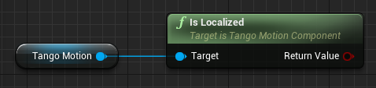

#### Description:
Returns true if the Tango is localized relative to the ADF file passed in as an argument in the Tango Config object when connecting to the Tango service.

#### Inputs:
- Target [[Tango Motion Component](#tango-motion-component) Reference]: The Unreal Engine / Tango Area Learning interface object.

#### Outputs:
- Return Value [Boolean]: Returns true if the Tango is currently localized relative to the loaded ADF.

----------------

### Reset Motion Tracking

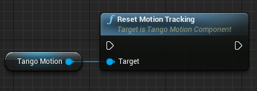

#### Description:
Resets the motion tracking of the tango device. This function is equivalent to the TangoService_ResetMotionTracking function.

#### Inputs:
- Target [[Tango Motion Component](#tango-motion-component) Reference]: The Unreal Engine / Tango Area Learning interface object.

----------------

### Get Tango Pose Status

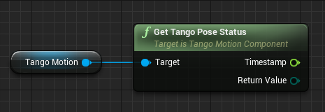

#### Description:
Returns the status of the pose information returned by the tango device.

#### Inputs:
Target [Tango Motion Component Reference]: The Unreal Engine / Tango Motion Component object.

#### Outputs:
- Timestamp [Float]: The seconds since tango service was started, when the latest pose was the latest pose was retrieved by this component.
- Return Value [[Tango Pose Status](#tango-pose-status) Enum]: Returns the status code of the latest pose retrieved by this motion component.

----------------

### Get Tango Pose At Time

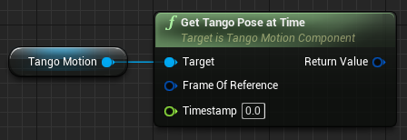

#### Description:
Returns a Tango pose object for the given time relative to a specific frame of reference.

#### Inputs:
- Target [Tango Motion Component Reference]: The Unreal Engine / Tango Area Learning interface object.
- Frame of Reference [Tango Coordinate Frame Pair Structure]: Specifies the frame of reference and target frame of reference.
- Timestamp [Float]: The timestamp for which the Tango pose data should be retrieved. A common use case is to take a timestamp returned from the event of another component (such as depth or image) to get the closest matching pose to that particular event.

#### Outputs:
- Tango Pose Data [[Tango Pose Data](#tango-pose-data) Structure]: A version of the Tango pose object from the indicated timestamp.

----------------

### Setup Pose Events

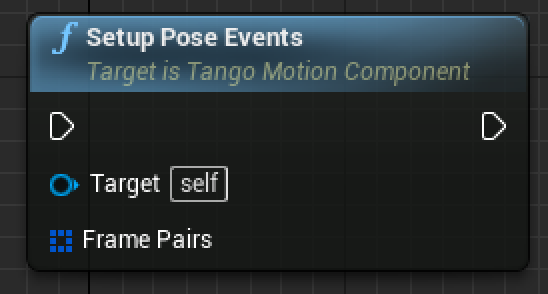

#### Description:
This configures Tango Motion Components to trigger Pose events for each of the provided coordinate frame pairs in the input array.
If this function is called twice, it will overwrite the previous set of coordinate frame pairs- so ensure that every frame pair you wish to receive an event for is included in this argument.

#### Inputs:
- Target [[Tango Motion Component](#tango-motion-component) Reference]: The Unreal Engine / Tango Area Learning interface object.
- Frame Pairs [ Array of [TangoCoordinateFramePair](#tango-coordinate-frame-pair) Structures]: Specifies all frames of reference which should trigger an appropriate OnTangoPoseAvailable event.

----------------

### Event On Tango Pose Available

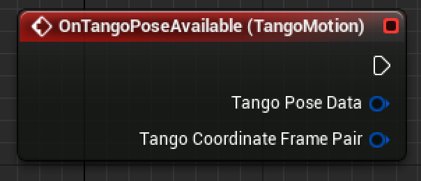

#### Description:
This event will fire every frame when a new Tango Pose has occurred, for those coordinate frame pairs which have been registered using the

#### Outputs:
- Tango Pose Data [[TangoPoseData](#tango-pose-data) Structure]: A version of the Tango pose object generated when this event is triggered.
- Tango Coordinate Frame Pair [[TangoCoordinateFramePair](#tango-coordinate-frame-pair) structure]: The base and target coordinate frames associated with this pose.

-----------------------

### Tango Image Component

The Tango Image Component contains the functions and events required to implement RGB Passthrough cameras in UE4 with the Tango.

Note that the Tango natively returns textures in the YUV format, and so conversion to RGB by way of a custom material is required. Several helper functions have been included to assist with this task.

For more information read:

[https://developers.google.com/project-tango/apis/c/reference/struct/tango-image-buffer](https://developers.google.com/project-tango/apis/c/reference/struct/tango-image-buffer)

-----------------------

### Get Latest Image Timestamp

#### Description:

Returns a float which represents the time (in seconds since the Tango service was started) when the latest Image pose was retrieved.

#### Inputs:
- Target [[Tango Image Component](#tango-image-component) Reference]: The Unreal Engine / Tango Image interface object.

#### Outputs:
Return Value [Float]: The time (in seconds since the Tango service was started) when the latest Image pose was retrieved.

-----------------------

### Event OnTangoImageAvailable

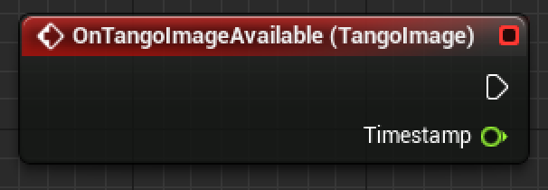

#### Description:
This event will fire every frame when a new Tango Pose has occurred.

#### Outputs:
Return Value [Float]: The time (in seconds since the Tango service was started) when the latest Image pose was retrieved.

-----------------------

## Tango AR Camera

The ARCameraComponent, when placed in a scene draws the real world in front of a Tango-enabled device to the screen. The component moves around the Unreal Engine world as the device is moved around the real world. The end result is that any objects within the Unreal Engine world will appear superimposed on top of the real world at the scale specified in the configuration struct.

Note that you will need to remove any skyboxes or features which encompass the entire screen from your levels, or you will not be able to see the passthrough camera effect (as these features will block the line of sight between the camera and the passthrough image).

For users of the beta versions of the plugin, the ARCameraComponent replaces the now deprecated 'Prepare Camera for Augmented Reality' function.

-----------------------

## Tango AR Screen

The ARScreenComponent displays the image from the Tango devices's front-facing camera on a 2D plane in the UE4 world.
The plane is static and will stay fixed in the UE4 world as the device is moved.

-----------------------

## Tango Point Cloud Component

The Point Cloud component provides access to the Tango Point Cloud functionality.
This access includes blueprint-accessible information about the latest point cloud as well as access to objects which can access the raw point cloud data in C++.
Additionally, this component provides blueprint helper functions which assist in many common AR/Depth tasks, such as finding the central point in an area on the screen, getting a matching point from a given set of screen coordinates, finding a plane from given depth points or getting all depth points in a given area.

----------------

### Pass Point Cloud Reference Container

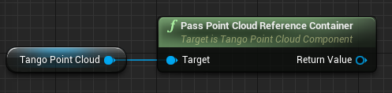

#### Description:
Passes a container object for the point cloud data around. Useful to provide other C++ scripts access to the point cloud without any additional copies. The reason this is useful is that all variable types except for UObjects which are expose to Blueprint by value- to avoid additional deep copies of the entire point cloud, this instead passes an object which contains a pointer which can be accessed in C++ code.

#### Inputs:
- Target [[Tango Point Cloud Component](#tango-point-cloud-component)  Reference]: The Unreal Engine / Tango Point Cloud interface object.

#### Outputs:
- Return Value [Point Cloud Container]: Container class for the point cloud.

----------------

### Get Current Point Count

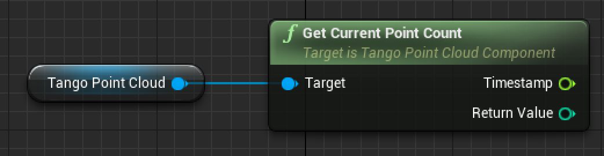

#### Description:
Retrieves the number of points contained within the latest frame from the point cloud.

#### Inputs:
- Target [[Tango Point Cloud Component](#tango-point-cloud-component) Reference]: The Unreal Engine / Tango Point Cloud interface object.

#### Outputs:

- Timestamp [Float]: The seconds since tango service was started, when the last point cloud was received.
- Return Value [Int]: Amount of points in the current point cloud.

----------------

### Get Single Point

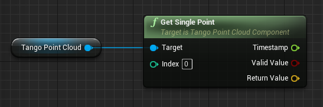

#### Description:
- Retrieve a single point from the point cloud.

#### Inputs:
- Target [[Tango Point Cloud Component](#tango-point-cloud-component) Reference]: The Unreal Engine / Tango Point Cloud interface object.
- Index [Int]: The index of the point.

#### Outputs:
- Timestamp [Float]: The seconds since tango service was started, when this point cloud was received.
- ValidValue [Boolean]: True when the point was successfully retrieved.
- Return Value [Vector]: Point from the point cloud in Unreal coordinates.

----------------

### Get Plane at Screen Coordinates

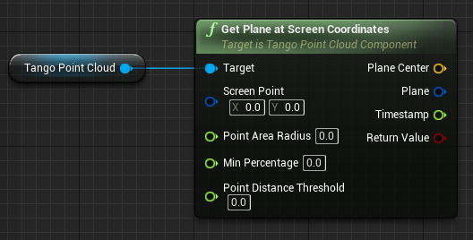

#### Description:
Retrieve the plane average of the points within range of the input screen point.

#### Inputs:
- Target [[Tango Point Cloud Component](#tango-point-cloud-component) Reference]: The Unreal Engine / Tango Point Cloud interface object.
- Screen Point [Vector 2D Structure]: Position on the screen in Pixels.
- Point Area Radius [Float]: Radius around screen point in Pixels.
- Min Percentage [Float]: Set a minimum percentage float
- Point Distance Threshold [Float]: Set the point distance threshold.

#### Outputs:
- Plane Center [Vector]: A point on the plane in world space
- Plane [Plane Structure]: plane structure in the format Ax + By + Cy = D
- Timestamp [Float]: The seconds since tango service was started, when this structure was generated.
- Return Value [Boolean]: Returns true if a plane was successfully retrieved.

----------------

### Get Max Point Count

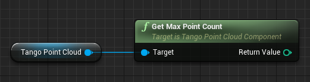

#### Description:
Get the max number of points a single frame from the point cloud can contain.

#### Inputs:
- Target [[Tango Point Cloud Component](#tango-point-cloud-component) Reference]: The Unreal Engine / Tango Point Cloud interface object.

#### Outputs:
- Return Value [Integer]: The maximum number of points the point cloud can contain.

----------------

### Get All Depth Points in Area

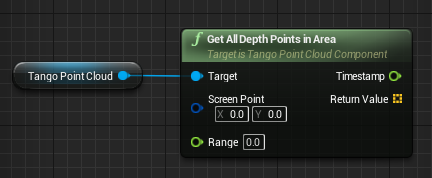

#### Description:
Get all points from the latest frame of the point cloud within the specified range of the input screen point.

#### Inputs:
- Target [[Tango Point Cloud Component](#tango-point-cloud-component) Reference]: The Unreal Engine / Tango Point Cloud interface object.
- Screen Point [Vector 2D]: Point on the screen in Pixels.
- Range [Float]: Range in Pixels around the screen point to return points from.

#### Outputs:
- Timestamp [Float]: The seconds since tango service was started, when this structure was generated.
- Return Value [Array of Vectors]: Returns all points from the latest frame of the depth buffer within range of the designated screen point.

----------------

### Find Closest Depth Point

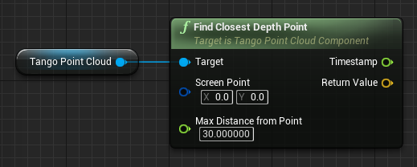

#### Description:
Retrieves the closest point to a specified position on the screen from within the point cloud buffer.

#### Inputs:
- Target [[Tango Point Cloud Component](#tango-point-cloud-component) Reference]: The Unreal Engine / Tango Point Cloud interface object.
- Screen Point [Vector 2D Structure]: Screen position in Pixels where the from the nearest depth point should be searched.
- Max Distance from Point [Float]: Cutoff distance in Unreal units, points with a higher depth value are being ignored.input

#### Outputs:
- Timestamp [Float]: Timestamp of the returned point. Measured in seconds after Tango startup.
- Return Value [Vector]: Returns closest depth point from the point cloud.

----------------

### Event On Tango XYZij Available

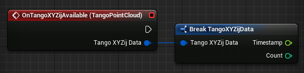

#### Description:
This event will fire on every tick when there a new Depth update has occurred.
It provides information about the number of points available in the latest depth frame, but not access to the raw buffer or helper functionality- these can be accessed by functions on the Point Cloud component instead.

#### Outputs:
- Tango XYZij Data [[TangoXYZij](#ftangoxyzijdata) Data Structure]: The Tango XYZij struct contains information returned from the depth sensor about how many points were returned during the latest Depth update, and the timestamp from the last Depth update. Please note that retrieval of individual points should occur from the "Get Single Point" function.

-----------------------

## Tango Points Component

This is a helper component which renders the depth points to screen in real time, relative to the position of the Points Component in UE4 space.
It's useful for a debugging or illustrative capacity and will allow you to directly observe the output of the depth camera in your scene with minimal effort.

-----------------------

## Tango Area Learning Component

Project Tango allows devices to use visual cues to navigate and understand the world around them. Using area learning, a Project Tango device can remember the visual features of the area it is moving through and recognize when it sees those features again. These features can be saved in an Area Description File (ADF) to use again later. With an ADF loaded, Project Tango devices gain two new features: improved motion tracking and localization.

Localization allows for users to synchronize movement within the Unreal world as reported by the Tango Motion component, with their position within a pre-recorded real-world area. This could allow for features such as fixing an A.R. tree within the center of a real-world room, or allowing for several users to share the same mixed reality space.

The Area Learning Component provides access to blueprint nodes that expose this functionality.

For more information on Area Learning, see:

[https://developers.google.com/project-tango/apis/c/c-area-learning](https://developers.google.com/project-tango/apis/c/c-area-learning)

[https://developers.google.com/project-tango/apis/c/reference/group/area-description](https://developers.google.com/project-tango/apis/c/reference/group/area-description)

----------------

### Save Meta Data

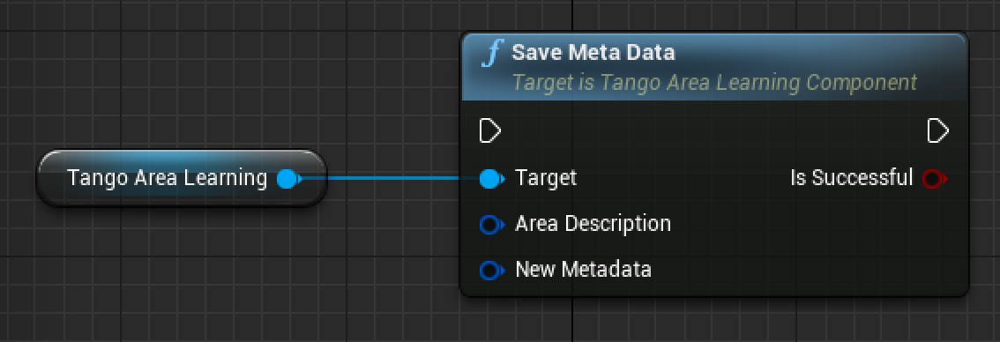

#### Description:
This function is allows users to set the metadata contained within a specified ADF.
This metadata includes the position where the ADF was created (in Earth Centered, Earth Fixed co-ordinates), and the Filename of the ADF. Please note that it is not possible to set the timestamp of the ADF- this is created automatically when the ADF is first recorded, and attempts to re-set this information will fail.

#### Inputs:
- Target [[Tango Area Learning Component](#tango-area-learning-component) Reference]: The Unreal Engine / Tango Area Learning interface object.
- Area Description [[FTangoAreaDescription](#tango-area-description)]: The ADF to modify the metadata of. @todo check data type
- New Metadata [FTangoAreaDescription Structure]: The struct containing the metatata to apply to the specified ADF.

#### Outputs:
- Is Successful [Boolean]: Returns true if the metadata save was successful.

----------------

### Get Meta Data

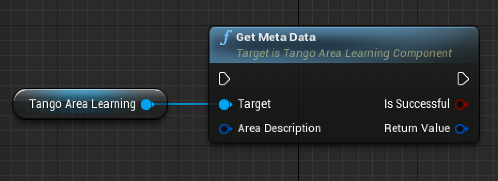

#### Description:

This function is used to expose the metadata contained within a specified ADF.
This metadata includes the position and time that the ADF was created, and the Filename of the ADF.

#### Inputs:
- Target [[Tango Area Learning Component](#tango-area-learning-component) Reference]: The Unreal Engine / Tango Area Learning interface object.
- Area Description [[FTangoAreaDescription](#tango-area-description)]: The ADF which to inspect.

#### Outputs:
- Is Successful [Boolean]: Returns true if the metadata get operation was successful.
 - Return Value [[FTangoAreaDescription](#tango-area-description) Meta Data Structure]: The metadata associated with this ADF, including the Filename, Time created (in milliseconds since the Unix Epoch), and the Earth Centered, Earth Fixed translation where the ADF was created.

----------------

### Import ADF

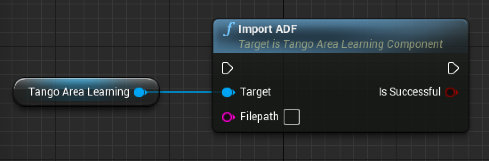

#### Description:
Imports the given Area Description File stored at the location denoted by the "Filepath" variable to the Tango core.
Note that this ADF becomes available to use with the current device but will still need to be loaded from the Tango core by restarting the Tango Service with the ADF within the Tango Core provided as an argument when starting up.

#### Inputs:
- Target [[Tango Area Learning Component](#tango-area-learning-component) Reference]: The Unreal Engine / Tango Area Learning interface object.
- Filepath [String]: The file path of the ADF to import.

#### Outputs:
- Is Successful [Boolean]: Returns true if the Import of the area description was successful.

----------------

### Export ADF

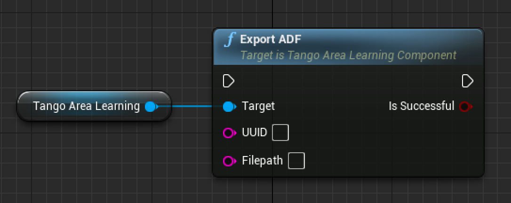

#### Description:
This function takes an existing, saved ADF within the device's Tango Core ADF repository, and saves the ADF to the file system in the location denoted by the 'Filepath' parameter, e.g. "/sdcard/".

#### Inputs:
- Target [[TangoAreaLearningComponent](#tango-area-learning-component) Reference]: The Unreal Engine / Tango Area Learning interface object.
- UUID [String]: The UUID of the ADF you wish to export.
- FilePath [String]: The file location to save your ADF on the file system.

#### Outputs:
- Is Successful [Boolean]: Returns true if the Export of the ADF was successful.

----------------

### Save Current Area

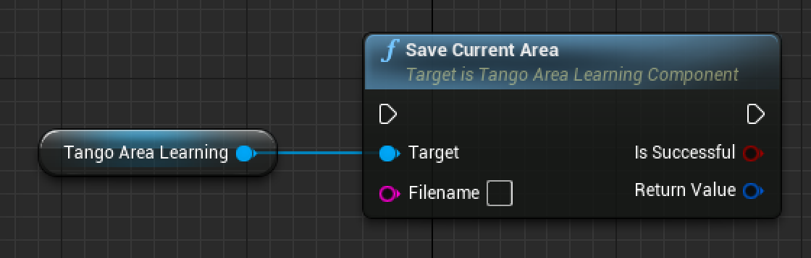

#### Description:
Save the current area description file to the device. For this to work, you must have at least one Area Learning and Motion component in the scene, and have switched 'Area Learning' mode on in your configuration file.

#### Inputs:
- Target [[Tango Area Learning Component](#tango-area-learning-component) Reference]: The Unreal Engine / Tango Area Learning interface object.
- FileName [String]: The file name to save your ADF with.

#### Outputs:
- Is Successful [Boolean]: Returns true if the save area description function was successful.
- Return Value [[FTangoAreaDescription](#tango-area-description)]: The UUID/Filename associated with the newly created ADF.

----------------

### Is Learning Mode Enabled

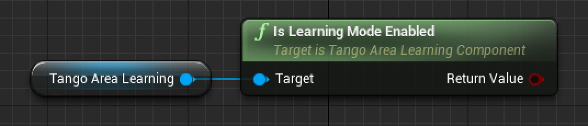

#### Description:
Returns true if Learning Mode is currently enabled.

#### Inputs:
- Target [[Tango Area Learning Component](#tango-area-learning-component) Reference]: The Unreal Engine / Tango Area Learning interface object.
- Input Name [Input type]: Short description of input

#### Outputs:
- Return Value [Boolean]: Returns true if learning mode is currently enabled.

----------------

### Delete Area Description

#### Description:
Delete the area description matching the UUID.

#### Inputs:
- Target [[Tango Area Learning Component](#tango-area-learning-component) Reference]: The Unreal Engine / Tango Area Learning interface object.
- UUID [String]: The Unreal Unique Identifier of the area description to be deleted.

#### Outputs:
- Return Value [Boolean]: Returns true if the area description was successfully deleted.

----------------

### Get All Area Description Data

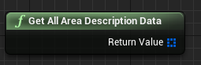

#### Description:
Get the current list of all the ADF UUIDs available in this device's Tango Core. Note that if there are any ADFs which are on the device's storage but not currently in the device's Tango Core repository, then developers should first call the "Import Current Area" function, supplying the filepath of the ADF they wish to import.

#### Inputs:
- Target [[TangoAreaLearningComponent](#tango-area-learning-component) Reference]: The Unreal Engine / Tango Area Learning interface object.

#### Outputs:
Return Value [Array of [FTangoAreaDescription](#tango-area-description) Structures]: An array of all tango area description structures available.

-----------------------

## Tango Event Component

The Tango Event Component allows for developers to register event handlers for the different events which can be fired by the Tango service.
These events either provide information about the status of the Tango service or indicate that errors have occurred.

----------------

### On Tango Connect event

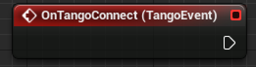

#### Description:
This event fires when a connection has been successfully made to the Tango service.

----------------

### On Tango Disconnect event

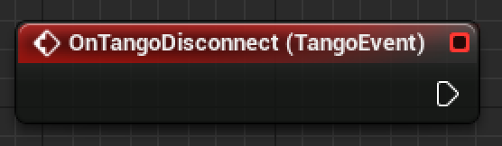

#### Description:
This event fires upon the Tango service being disconnected.

----------------

### On Tango Service Exception event

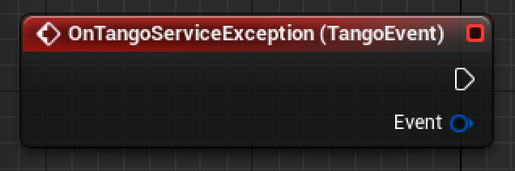

#### Description:
This event fires when the Tango service encounters an exception.
Check the TangoEvent data structure for more information about the service exception.

#### Outputs:
- Event [[TangoEvent](#tango-event) structure]: Data relating to the event

----------------

### On Fisheye Over Exposed event

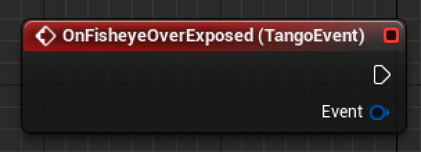

#### Description:
This event fires when the Fisheye camera is over-exposed, which will interfere with the Tango Motion Tracking capabilties.
Address this event by moving the Tango device to a less brightly lit area.

#### Outputs:
- Event [[TangoEvent](#tango-event) structure]: Data relating to the event

----------------

### On Fisheye Under Exposed event

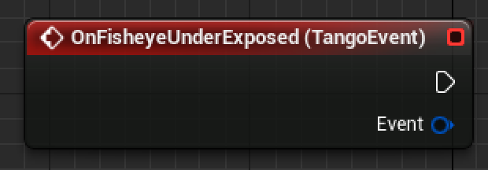

#### Description:
This event fires when the Fisheye camera is under-exposed, which will interfere with the Tango Motion Tracking capabilties.
Address this event by moving the Tango device to a more brightly lit area.

#### Outputs:
- Event [[TangoEvent](#tango-event) structure]: Data relating to the event

----------------

### On Color Over Exposed event

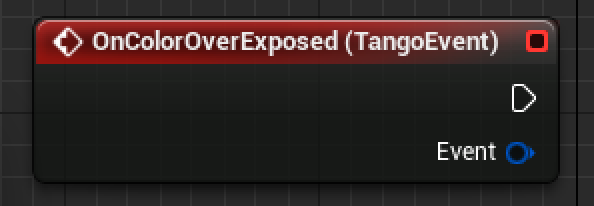

#### Description:
This event fires when the Tango Color Camera is over exposed.
Address this event by moving the Tango device to a less brightly lit area.

#### Outputs:
- Event [[TangoEvent](#tango-event) structure]: Data relating to the event.

----------------

### On Color Under Exposed event

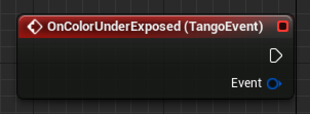

#### Description:
This event fires when the Tango color camera is under exposed.
This will fire in dimly lit environments- move the Tango to a more brightly lit area to address this exception.

#### Outputs:
- Event [[TangoEvent](#tango-event) structure]: Data relating to the event.

----------------

### On Too Few Features Tracked event

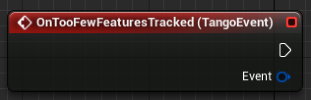

#### Description:
This event fires when the Tango service cannot find enough features using the fisheye camera to properly run the motion tracking service.
Feature-sparse environments, such as blank white walls, will trigger this more often than brigthtly lit, complex environments such as walls with posters placed upon them.

#### Outputs:
- Event [[TangoEvent](#tango-event) structure]: Data relating to the event.

----------------

### On Area Description Save Progress event

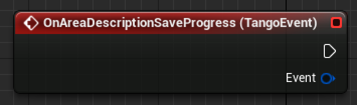

#### Description:
This event fires while an ADF save is taking place, and the TangoEvent message will display the percentage completion of the save.

#### Outputs:
- Event [[TangoEvent](#tango-event) structure]: Data relating to the event.

----------------

## On Unknown event

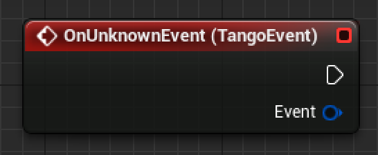

#### Description:
This event fires when the Tango service encounters an error with an unknown error code or type.

#### Outputs:
- Event [[TangoEvent](#tango-event) structure]: Data relating to the event.

----------------

### On File Import event

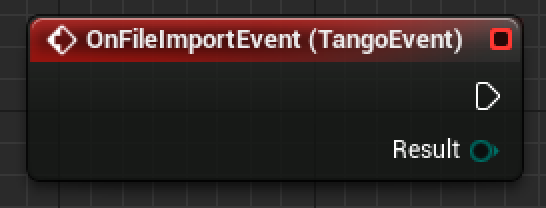

#### Description:
This event fires when an ADF file import has been attempted, and provides an enumeration which describes whether the export attempt has succeeded or failed.

#### Outputs:
- Event [[TangoEvent](#tango-event) structure]: Data relating to the event.

----------------

### On File Export Event

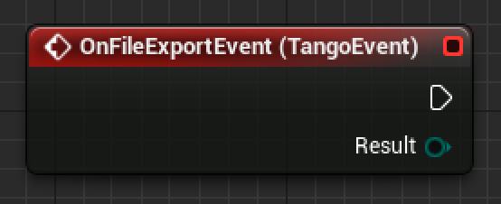

#### Description:
This event fires when an ADF file export has been attempted, and provides an enumeration which describes whether the export attempt has succeeded or failed.

#### Outputs:
- Event [[TangoEvent](#tango-event) structure]: Data relating to the event

-----------------------

## Tango Blueprint Function Library

The following nodes can be accessed within any blueprint when the Tango plugin has been enabled.
They are used to retrieve information which does not relate to any particular component, or activate functions which deal with the lifecycle of the Tango service, such as connection and disconnection.

----------------

### Set Tango Runtime Config

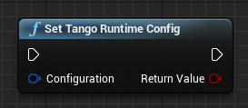

#### Description:
Sets the runtime-settable parameters of the Tango to the values of the FTangoRuntimeConfig struct passed into the Configuration argument.

#### Inputs:
- Configuration [[FTangoRuntimeConfig](#ftangoruntimeconfig)]: The runtime-settable configuration parameters to pass the Tango service.

#### Outputs:
- Return Value: returns true if the runtime configuration values were successfully set.

----------------

### Reconnect Tango Service

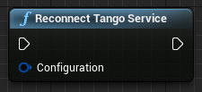

#### Description:
Disconnects the currently connected Tango service and reconnects the Tango service with the given configuration parameters.

#### Inputs:
- Configuration [[FTangoConfig](#ftangoconfig)]: The configuration parameters to pass the Tango service.

----------------

### Is Tango Service Running

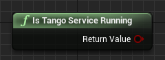

#### Description:
Returns true if the Tango Service is currently connected and running, otherwise returns false.

#### Outputs:
- Return Value [Boolean]: True if the Tango Service is currently connected and running, otherwise false.

----------------

### Get Tango Config

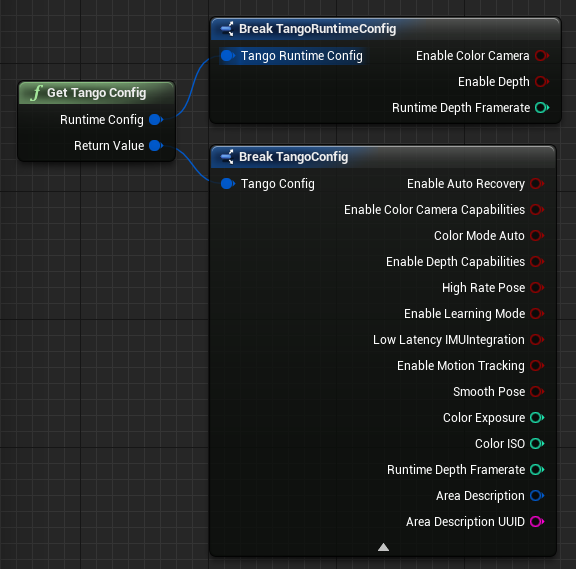

#### Description:
Returns structures representing the current Tango Config and Tango Runtime Config.

#### Outputs:
- Runtime Config [[FTangoRuntimeConfig](#ftangoruntimeconfig)]: A struct containing the current runtime-settable configuration options.
- Return Value [[FTangoConfig](#ftangoconfig)]: A struct containing the current non-runtime-settable configuration options.

----------------

### Get Loaded Area Description

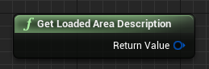

#### Description:
Returns the currently loaded Area Definition file.

#### Outputs:
- Return Value [[FTangoAreaDescription](#tango-area-description)]: the ADF that is currently loaded. If no ADF is currently loaded, this will return a struct with blank values for UUID and Filename.

----------------

### Get Last Area Description

#### Description:
Returns the last used Area Definition file.

#### Outputs:
- Return Value [[FTangoAreaDescription](#tango-area-description)]: the latest ADF that was used by this device.

----------------

### Get Camera Intrinsics

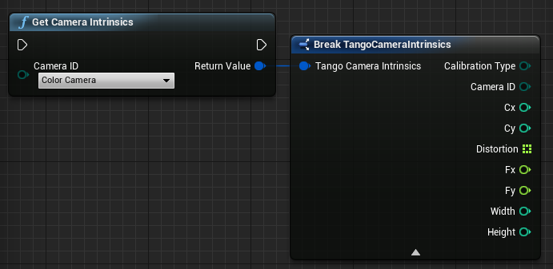

#### Description:
Returns a structure containing information about the nature of the selected camera. This is useful for many Augmented Reality and camera alignment calculations.

#### Inputs:
- Camera ID [[FTangoCameraType](#tango-camera-type)]: an enumeration which denotes which camera's intrinsics information should be returned in the output TangoCameraIntrinsics struct.

#### Outputs:
- Return Value [[FTangoCameraIntrinsics](#tango-camera-intrinsics)]: an array of all the UUID/Filename pairs stored within this device's Tango Core repository.

----------------

### Get All Area Description Data

#### Description:
Returns an array containing all of the Area Description files which are stored within this devices's Tango Core Repository. Please note that this does not include ADFs stored in other areas on the file system of the device.

#### Outputs:
- Return Value [[FTangoAreaDescription](#tango-area-description)]: an array of all the UUID/Filename pairs stored within this device's Tango Core repository.

----------------

### Disconnect Tango Service

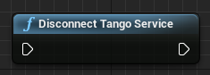

#### Description:
Disconnects the Tango service.

Note that it's not required to call this function on EndPlay- the Tango plugin will automatically perform a disconnection when the app is paused or closed, and will automatically resume if the app is brought back into the foreground.

----------------

### Connect Tango Service

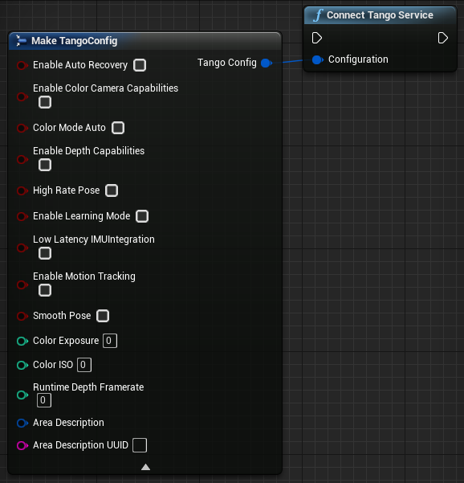

#### Description:
Connects the Tango service with the given configuration parameters.
All Tango components require the Tango service to be connected in order to function correctly, and developers must manually connect using this function.

#### Inputs:
- Configuration [[FTangoConfig](#ftangoconfig)]: The configuration parameters to pass the Tango service.
- Runtime Configuration [[FTangoRuntimeConfig](#ftangoruntimeconfig)]: The runtime configuration parameters for the Tango service, including whether the Camera and Depth camera should be enabled and the desired frame rate of the depth camera.

-----------------------

## Tango Enumerations

The following enumerations are used in the Tango plugin. In many cases they mirror the enumerations found in the Tango C or Java APIs.
For more information about these, [see here](https://developers.google.com/tango/apis/c/reference/group/enums).

----------------------

### Tango Pose Status

#### Description:
This enumeration represents the state of the current pose- a pose will contain data which is usable only when in the 'Valid' state.

### Valid values:
- [0] Tango pose initializing
- [1] Tango pose valid
- [2] Tango pose invalid
- [3] Tango pose unknown

--------

### Tango Camera Type

#### Description:
This enumeration represents each different type of camera which can be found on a Tango device.

### Valid values:
- [0] Color Camera
- [1] Depth Camera
- [2] Fisheye Camera
- [3] RGBIR Camera

--------

### Tango Event Key

#### Description:
This enumeration represents each type of event which can be fired from the Tango Event component.

### Valid values:
- [0] Area Description Save Progress
- [1] Service Exception
- [2] Color Over Exposed
- [3] Color Under Exposed
- [4] Fisheye Over Exposed
- [5] Fisheye Under Exposed
- [6] Too Few Features Tracked
- [7] Unknown Event
- [8] Import Completed
- [9] Export Completed

--------

### Tango Event Type

#### Description:
This is a list of all the different classes of events which can be fired from the Tango Event component.

### Valid values:
- [0] Area Learning Event
- [1] Color Camera Event
- [2] Feature Tracking Event
- [3] Fisheye Camera Event
- [4] General Event
- [5] IMU Event
- [6] Unknown Event

--------

### Tango Request Result

#### Description:
This enumeration signals whether a request to the Tango service (e.g. an ADF Import or Export request) has been accepted, denied or been cancelled by the user.

### Valid values:
- [0] Success- User agrees.
- [1] Cancelled- User has cancelled the request.
- [2] Denied- User does not agree.

--------

### Tango Calibration Type

#### Description:
This Enum directly corresponds to the TangoCalibrationType enum of the Tango C API.
Please see [https://developers.google.com/tango/apis/c/reference/group/enums](https://developers.google.com/tango/apis/c/reference/group/enums) for more information.

### Valid values:
- [0] Equidistant
- [1] Polynomial: 2 parameters
- [2] Polynomial: 3 parameters
- [3] Polynomial: 5 parameters
- [4] Unknown

--------

### Tango Coordinate Frame Type

#### Description:
This is a list of all the different supported Coordinate Frame types.

### Valid values:
- [0] Global: WGS84
- [1] Area Description
- [2] Start of Service
- [3] Previous Device Pose
- [4] Device
- [5] IMU
- [6] Display
- [7] Camera: Color
- [8] Camera: Depth
- [9] Camera: Fisheye

-----------------------

## Tango Data Types

The following custom data structures are used in the Tango plugin.

--------

### FTangoConfig

#### Description:
This data structure is used to set the configuration of the Tango service. The data structure is set up and then passed as an argument to functions such as Start Tango Service and Restart Tango Service.

#### Fields:
- Enable Auto Recovery [bool]: If set to true, the Tango motion tracking will attempt to re-locate itself in the event that the service becomes confused or momentarily lost.
- Enable Color Camera Capabilities [bool]: If set to true, the color camera may be used by the application. Remember to also set the color camera to update using the Tango Runtime Config.
- Color Mode Auto [bool]: If set to true, the Color ISO and Color Exposure fields will be ignored and the camera will auto-adjust to attempt to capture the best possible image.
-  Enable Depth Capabilities [bool]: If set to true, the application may use depth functionality when the Runtime Config 'Enable Depth' flag is also set to true.
- High Rate Pose [bool]: If set to true, the Tango motion service will perform at a far higher frame rate than otherwise. Recommended for any application which needs to position objects, including the camera, in real time. Required for passthrough A.R. applications.
- Low Latency IMUIntegration [bool]: If set to true, the Tango service will take advantage of any available hardware motion tracking capabilities the current device may have available. Recommended for passthrough A.R. applications.
- Enable Motion Tracking [bool]: Enables the application to use data related to the motion service. If disabled, the application will not be able to use the Tango Motion or Area Learning component functionality. Required for A.R. applications.
- Smooth Pose [bool]: If set to true, the Tango service will interpolate between the available motion data frames to estimate the device's position at the requested position, rather than return the latest known pose. This results in smoother 'Magic Window' applications, but MUST be turned off for A.R. applications or the image and motion data will become desynchronised and a visible 'sloshing' artifact will occur.
- Color Exposure [int]: The desired camera exposure time, in milliseconds. Will be ignored if 'Color Mode Auto' flag is set to true.
- Color ISO [int]: The desired ISO of the color camera. Will be ignored if 'Color Mode Auto' flag is set to true.
- Area Description [[Tango Area Description](#tango-area-description)]: A struct which references  the ADF you'd like to load into the Tango Service for use with the Tango Motion and Area Learning components.

--------

### FTangoRuntimeConfig

#### Description:
This data structure is used to set the configuration of the Tango service. The data structure is set up and then passed as an argument to functions such as Start Tango Service and Restart Tango Service.

#### Fields:
- Enable Depth [bool]: If checked, and the requisite Enable Depth Capabilities field of the supplied TangoConfig is also checked, then the Tango device will continuously scan for Depth data at the specified Framerate.
- Enable Color Camera [bool]: If checked, and the requisite Enable Color Camera Capabilities field of the supplied TangoConfig is also checked, then the Color camera will continuously update, populating any relevant in-game textures with the latest available camera image.
- Runtime Depth Framerate [int]: The desired hertz of the depth camera. Depth frames will refresh this many times each second, assuming the number is valid for your device. For example, currently values between 0-5 are accepted by the Tango Yellowstone tablet.

--------

### Tango Camera Intrinsics

#### Description:
This data structure contains the mappings for the camera intrinsics, which area camera parameters used in mapping sensor data to Unreal Engine world co-ordinates. See [https://developers.google.com/tango/overview/intrinsics-extrinsics](https://developers.google.com/tango/overview/intrinsics-extrinsics) for more details on how camera Intrinsics and Extrinsics can be used to power AR experiences.

#### Fields:
- Calibration Type [[FTangoCalibrationType](#tango-calibration-type)]: The type of calibration which has been currently achieved by the given camera.
- Camera ID [[FTangoCameraType](#tango-camera-type)]: Designates which camera's intrinsics are represented by this struct.
- Cx [int]: The Cx value of this camera.
- Cy [int]: The Cy value of this camera.
- Distortion [float array]: An array of length 5 which contains the distortion parameters of this camera.
- Fx [int]: The Fx value of this camera.
- Fy [int]: The Fy value of this camera.
- Width [int]: The width of the image output resolution of this camera.
- Height [int]: The height of the image output resolution of this camera.

--------

### FTangoXYZijData

#### Description:
This data structure holds information about a Tango Point cloud, including the timestamp and how many points are contained within the current Point cloud.

Note that Blueprint users are restricted in how they may use data- we suggest either using the "Get Single Point" function to access individual array points, or if iteration over all Depth points is required, using C++.

#### Fields:
- Timestamp [Float]: The seconds since tango service was started, when this structure was generated.
- Count [Integer]: The number of Points (FVectors) contained within the latest point cloud.

--------

### Tango Coordinate Frame Pair

#### Description:
Tango pose data is calculated as a transformation between two frames of reference (so, for example, you can be asking for the pose of the device within a learned area).
This struct is used to specify the desired base and target frames of reference when requesting pose data. You can also use it when you have a TangoPoseData structure returned from the API and want to examine which frames of reference were used to get that pose.
For more information, including which coordinate frame pairs are valid, read [here](https://developers.google.com/tango/overview/frames-of-reference).

#### Fields:
- Base Frame [[TangoCoordinateFrameType](#tango-coordinate-frame-type) Enum]: The co-ordinate from which to obtain the 'starting position' of a given pose, e.g. the point in space where the tango was present when the service started up.
- Target Frame [[TangoCoordinateFrameType](#tango-coordinate-frame-type) Enum]: The co-ordinate from which to obtain the 'current position' of a given pose, e.g. the current position of the Device.

--------

### Tango Event

#### Description:
This struct contains metadata relating to various types of Tango events, and is passed through when those events fire.
Each event can pass additional information through the Message string, and the format and type of information presented will depend on which event has fired.

#### Fields:
- Key [[TangoEventType](#tango-event-type)]: Represents the name of the particular event which has been fired.
- Type [[TangoEventType](#tango-event-type)]: Represents the class of event which has been fired.
- Message [String]: Message detail from the event. Possible output values will depend on the type of the event.
- TimeStamp [float]: The time in seconds since the Tango Service started.

--------

### Tango Pose Data

#### Description:
The TangoPoseData struct contains pose information returned from motion tracking.

#### Fields
Position [Vector]: The position of the tango device.
Rotation [Rotator]: The rotation of the tango device.
Frame of Reference [[Tango Coordinate Frame Pair](#tango-coordinate-frame-pair) Structure]: The Frame of Reference for this TangoPoseStructure; for example Base: Start of Service, Target: Device.
Status Code [[Tango Pose Status](#tango-pose-status) Enum]: The current status of the pose- can be Valid, Initializing, or Invalid.
Timestamp [Float]: The number of seconds since the tango service was started, when this structure was generated.

--------

### Tango Area Description

#### Description:
This is the Filename/UUID pair representing an ADF which is currently within the Tango Core of the user's device. It can be used as an input for the Connect node, in which case the system will attempt to localize against it.

#### Fields
UUID [String]: A universally unique identifier for the ADF, represented as a string.
Filename [String]: The name of the file.
